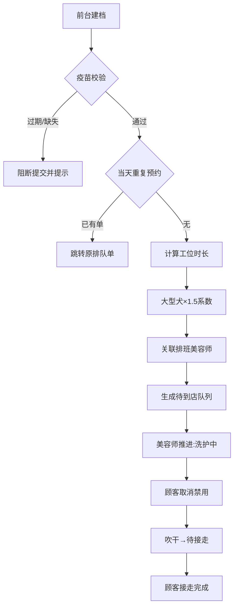

## 1. 产品概述
面向宠物美容门店的全流程排队管理系统，覆盖前台建档、美容师看板操作、顾客自助查询三大场景，解决门店排队混乱、状态不透明、疫苗管理缺失等痛点。通过数据本地持久化，确保轻量部署即可运行，内置自动化验证脚本确保核心业务逻辑正确。

## 2. 核心功能

### 2.1 用户角色
| 角色 | 登录方式 | 核心权限 |
|------|----------|----------|
| 前台 | 角色切换入口 | 建宠物档案、查看排班、登记异常结束、处理重复预约跳转 |
| 美容师 | 角色切换入口 | 查看看板、推进洗护状态（待到店→洗护中→吹干→待接走） |
| 顾客 | 手机号/会员号查询 | 查看本人宠物排队顺序、预计等待/完成时间、尝试取消预约 |

### 2.2 功能模块
1. **门店排班主页**：当天美容师排班列表、工位占用情况总览、快速入口导航
2. **宠物档案建档页**：录入宠物基本信息、体型分类、疫苗有效期、过敏备注、会员联系方式
3. **美容师看板页**：四列状态看板（待到店/洗护中/吹干/待接走）、拖拽或按钮推进状态、异常结束登记入口
4. **顾客查询页**：仅展示关联本人宠物的排队卡片、顺序号与预计时间展示、取消按钮（状态受限）
5. **自动化验证面板**：疫苗过期提示验证、服务中取消失败验证、大型犬排队时长验证

### 2.3 页面详情
| 页面名称 | 模块名称 | 功能描述 |
|----------|----------|----------|
| 门店排班主页 | 排班卡片区域 | 展示当日值班美容师头像、姓名、工号、当前负责宠物数、忙碌状态 |
| 门店排班主页 | 工位状态条 | 横向时间轴展示各工位占用时段，大型犬自动延长色块宽度 |
| 宠物档案建档页 | 基本信息表单 | 宠物名、物种（猫/狗/其他）、品种、性别、年龄、体型下拉（小型/中型/大型/巨型） |
| 宠物档案建档页 | 健康信息区块 | 疫苗有效期日期选择器（带过期红标预警）、过敏史多行文本、特殊护理备注 |
| 宠物档案建档页 | 会员联系区块 | 会员号输入框、主人姓名、联系电话、关联已有会员自动填充 |
| 宠物档案建档页 | 提交预约区块 | 选择服务项目（基础洗护/精洗/SPA/造型等）、选择值班美容师、提交校验 |
| 美容师看板页 | 四列状态看板 | 每列顶部显示计数徽标、卡片展示宠物名+体型标签+服务项目+预计时长 |
| 美容师看板页 | 状态推进按钮 | 每张卡片底部提供"推进到下一状态"按钮，附带操作时间戳 |
| 美容师看板页 | 异常结束入口 | "服务异常结束"按钮，需前台权限，弹出原因登记框 |
| 顾客查询页 | 身份验证区 | 手机号/会员号输入 + 查询按钮，错误提示友好 |
| 顾客查询页 | 排队信息卡片 | 大号序号展示、当前状态、预计开始/完成时间、进度条可视化 |
| 顾客查询页 | 取消预约按钮 | 状态未开始时可点击，已开始后置灰禁用并提示"请联系前台" |
| 自动化验证面板 | 三个验证用例卡片 | 一键触发验证、实时显示通过/失败结果、输出详细验证日志 |

## 3. 核心流程
### 3.1 建档预约流程
前台选择体型与疫苗日期 → 系统校验疫苗是否过期（过期/缺失阻断提交） → 校验同一宠物当天是否已有排队单（有则跳转原单） → 大型犬自动计算延长工时 → 关联排班美容师并占用工位时间 → 生成排队单进入"待到店"队列

### 3.2 状态流转流程
待到店卡 → 美容师点击"开始洗护" → 洗护中（记录开始时间，顾客取消按钮禁用） → 点击"吹干定型" → 吹干 → 点击"等待接走" → 待接走（顾客完成提醒）

### 3.3 顾客取消流程
顾客查询排队单 → 状态为"待到店"时取消按钮可用 → 确认取消 → 释放工位占用；状态为"洗护中"及以后 → 按钮置灰 → 提示需前台处理 → 前台异常结束登记

## 4. 用户界面设计
### 4.1 设计风格
- **主色**：温暖奶油米色 `#FDF6EC` 搭配治愈系橘橙 `#F4A261` 作为品牌主色，医疗感薄荷绿 `#2A9D8F` 作为健康/疫苗状态色，警示砖红 `#E76F51` 标记异常
- **次色**：柔和雾霾蓝 `#264653` 作为信息色，暖黄 `#E9C46A` 标记等待中状态
- **按钮风格**：大圆角 14px，悬停有 2px 上浮 + 柔光阴影，主按钮渐变填充，次按钮描边+浅色底
- **字体**：标题用 `ZCOOL KuaiLe` 圆体增添亲和力，正文用 `Noto Sans SC` 保证可读性，数字用 `JetBrains Mono` 等宽字体
- **布局风格**：卡片式圆角容器 + 柔和阴影分层，看板采用四列均等栅格，排班页采用时间轴横向布局
- **图标风格**：emoji 表情符号 + 线性 SVG 图标混用，宠物状态用🐾🛁💨🏠表情对应

### 4.2 页面设计概览
| 页面名称 | 模块名称 | UI元素设计 |
|----------|----------|------------|
| 门店排班主页 | 排班卡片 | 头像圆形裁切+在线绿点，橘色渐变边框标记忙碌，悬停卡片轻微放大 |
| 门店排班主页 | 工位时间轴 | 横向甘特图样式，不同体型用不同颜色条，大型犬条宽自动放大1.5倍 |
| 宠物档案建档页 | 表单区 | 左标签右输入两列布局，疫苗日期框带日历图标，过期自动红框+警告角标 |
| 美容师看板页 | 四列看板 | 每列顶部色带区分状态（蓝→绿→黄→紫），卡片可拖拽，推进按钮脉冲动画 |
| 顾客查询页 | 排队卡片 | 大号圆形序号徽章居中，进度条分段着色，预计时间用大号等宽字体 |
| 自动化验证面板 | 用例卡片 | 绿色对勾/红色叉号大图标，日志区可折叠，运行按钮呼吸光晕 |

### 4.3 响应式
桌面端优先（≥1280px）：看板四列并排，表单双列布局
平板端（768-1279px）：看板改为两列两行堆叠，表单单列
移动端（<768px）：看板纵向单列滑动，排班时间轴横向滚动，表单全宽单列
触控优化：按钮最小高度48px，卡片点击反馈缩放0.97

### 4.4 动效设计
- 页面加载：各模块依次淡入上浮（stagger 80ms）
- 状态推进：卡片从原列滑出 + 目标列滑入，带缩放过渡
- 疫苗校验：过期时日期框抖动动画 + 红色光晕脉冲
- 大型犬时长计算：工位条宽度平滑过渡动画
- 验证用例：运行时进度条流光动画，结果弹出弹性动画
