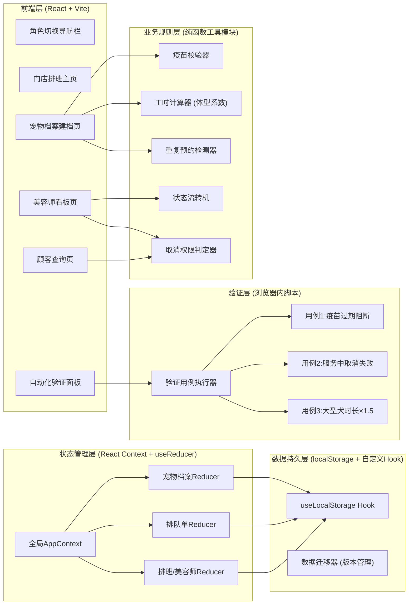
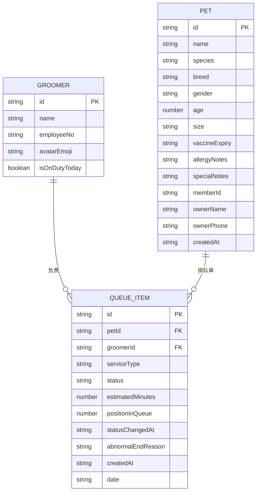

## 1. 架构设计



## 2. 技术描述
- **前端框架**: React@18.3 + React Router@6（Hash路由，适配本地文件部署）
- **样式方案**: TailwindCSS@3.4 + CSS变量（主题色、动画关键帧）
- **构建工具**: Vite@5（开发服务器支持热更新）
- **状态管理**: React Context + useReducer（避免引入Redux复杂度）
- **数据持久化**: localStorage + 自定义useLocalStorage Hook（JSON序列化，带数据版本号）
- **动画库**: Framer Motion（看板卡片拖拽、页面过渡、微交互）
- **图标**: Lucide React（线性图标）+ emoji 原生表情
- **字体**: Google Fonts 引入 ZCOOL KuaiLe、Noto Sans SC、JetBrains Mono
- **后端**: 无后端，全部逻辑前端实现，数据本地保存
- **Mock数据**: 内置当日排班3名美容师、示例宠物档案5份、示例排队单3份

## 3. 路由定义
| 路由路径 | 页面组件 | 访问角色 | 用途 |
|----------|----------|----------|------|
| `/` | SchedulePage | 全部 | 门店排班主页（默认首页） |
| `/register` | PetRegisterPage | 前台 | 宠物档案建档与预约提交 |
| `/board` | GroomerBoardPage | 美容师/前台 | 美容师四列看板与状态推进 |
| `/customer` | CustomerViewPage | 顾客 | 顾客排队进度自助查询 |
| `/validate` | ValidationPanelPage | 全部（调试用） | 自动化脚本验证面板 |
| `*` | NotFoundPage | - | 404页面带返回首页按钮 |

## 4. 核心业务API（前端函数签名）
```typescript
// ========== 数据模型类型定义 ==========
type PetSize = 'SMALL' | 'MEDIUM' | 'LARGE' | 'GIANT';
type QueueStatus = 'WAITING_ARRIVAL' | 'WASHING' | 'DRYING' | 'PICKUP';
type ServiceType = 'BASIC_WASH' | 'PREMIUM_WASH' | 'SPA' | 'STYLING';

interface Pet {
  id: string;
  name: string;
  species: string;
  breed: string;
  gender: 'M' | 'F';
  age: number;
  size: PetSize;
  vaccineExpiry: string | null; // ISO日期字符串
  allergyNotes: string;
  specialNotes: string;
  memberId: string | null;
  ownerName: string;
  ownerPhone: string;
  createdAt: string;
}

interface QueueItem {
  id: string;
  petId: string;
  serviceType: ServiceType;
  groomerId: string;
  status: QueueStatus;
  estimatedMinutes: number; // 已乘体型系数
  positionInQueue: number;
  statusChangedAt: Record<QueueStatus, string | null>;
  abnormalEndReason: string | null;
  createdAt: string;
  date: string; // YYYY-MM-DD，用于当日查重
}

interface Groomer {
  id: string;
  name: string;
  employeeNo: string;
  avatarEmoji: string;
  isOnDutyToday: boolean;
  currentQueueIds: string[];
}

// ========== 纯函数业务规则 ==========
/** 疫苗校验：返回 {valid: boolean, message: string} */
function validateVaccine(vaccineExpiry: string | null): { valid: boolean; message: string };

/** 计算服务时长（含体型系数）：小型×1, 中型×1.2, 大型×1.5, 巨型×2 */
function calculateDuration(baseMin: number, size: PetSize): number;

/** 检测当天重复预约：返回已存在排队单或null */
function findDuplicateTodayQueue(
  petId: string,
  today: string,
  allQueues: QueueItem[]
): QueueItem | null;

/** 判断顾客是否可取消：仅 WAITING_ARRIVAL 状态可取消 */
function canCustomerCancel(status: QueueStatus): boolean;

/** 状态流转机：返回下一状态或原状态（不可推进时） */
function nextStatus(current: QueueStatus): QueueStatus;

// ========== 验证用例函数 ==========
interface ValidationResult {
  name: string;
  passed: boolean;
  logs: { time: string; level: 'INFO' | 'ERROR' | 'SUCCESS'; msg: string }[];
  durationMs: number;
}
function runVaccineExpiryValidation(): ValidationResult;
function runServiceCancelBlockedValidation(): ValidationResult;
function runLargeDogDurationValidation(): ValidationResult;
```

## 5. 数据模型ER图



## 6. localStorage 存储结构
```json
{
  "__schema_version": "1.0.0",
  "__last_migrated": "2026-06-11T00:00:00.000Z",
  "groomers": [ /* Groomer[] */ ],
  "pets": [ /* Pet[] */ ],
  "queueItems": [ /* QueueItem[] */ ],
  "currentRole": "RECEPTIONIST" | "GROOMER" | "CUSTOMER"
}
```

## 7. 初始化脚本（seed数据）
- 美容师3人：李师傅(🐱)、王师傅(🐶)、张师傅(🐰)，今日均在岗
- 基础服务时长基准：基础洗护60min、精洗90min、SPA120min、造型150min
- 体型系数基准表：SMALL=1.0, MEDIUM=1.2, LARGE=1.5, GIANT=2.0
- 示例数据：1只疫苗过期的大型犬、1只正常中型犬、1只已在洗护中的小型犬
